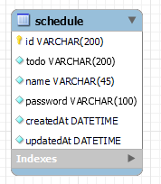

# calendar

> API 명세서 
> 
> | 기능       | Method | URL                   | Request                                                          | Response | 상세코드       |
> |----------|--------|-----------------------|------------------------------------------------------------------|----------|------------|
> | 일정 추가    | `post` | calender/add          | {"todo" : "What should I do?","name" : "Kim","password" : "123"} | -        | 200: 정상 등록 |
> | 모든 일정 조회 | `get`  | calender/findAll      | -                                                                |{"todo": "What should I do?1","name": "Kim1","createdAt": "2024-02-12","editedAt": "2024-02-12"},{"todo": "What should I do?","name": "Kim","createdAt": "2024-02-12","editedAt": "2024-02-12"}| 200: 정상 조회 |
> | 모든 일정 조회 | `get`  | calender/findSchedule | {id: "ad1cfe52-e419-4905-a6b0-3410552b7d1b"}                                                           |{"todo": "What should I do?","name": "Kim","createdAt": "2024-02-12","editedAt": "2024-02-12"}| 200: 정상 조회 |

> E-R 다이어그램
> 
> 
> 
> 
