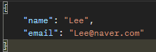
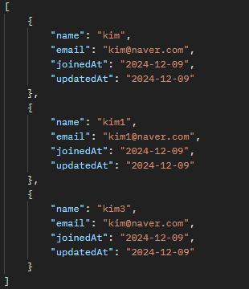
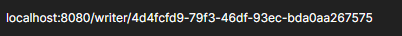
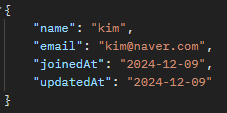
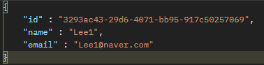
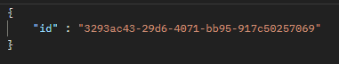

[Read.me로 돌아가기](README.md)
> # Calendar API - Writer
> ## Writer api 링크 
> [작성자 추가](#작성자-추가) 
> [모든 작성자 조회](#모든-작성자-조회) 
> [작성자 조회](#작성자-조회) 
> [작성자 수정](#작성자-수정) 
> [작성자 삭제](#작성자-삭제) 
> 
>  ## 기능:
> ### 작성자 추가
>
> ## Method:
> `post`
>
> ## URL:
> `/writer/sign-up`
>
> ## Request:
>
> 
>
> ## Response:
> x
>
> ## 상세코드:
>
> 200: 정상 등록 
>
[맨 위로](#top)

>  ## 기능:
> ### 모든 작성자 조회
>
> ## Method:
> `get`
>
> ## URL:
> `/writer/all-writer`
>
> ## Request:
> x
>
> ## Response:
> 
>
> ## 상세코드:
>
> 200: 정상 조회 
>
[맨 위로](#top)

>  ## 기능:
> ### 작성자 조회
>
> ## Method:
> `get`
>
> ## URL:
> `/writer`
>
> ## Request:
> 
>
> ## Response:
> 
>
> ## 상세코드:
>
> 200: 정상 조회 
>
[맨 위로](#top)

>  ## 기능:
> ### 작성자 수정
>
> ## Method:
> `put`
>
> ## URL:
> `/writer`
>
> ## Request:
> 
>
> ## Response:
> x
> ## 상세코드:
>
> 200: 정상 수정 
>
[맨 위로](#top)

>  ## 기능:
> ### 작성자 삭제
>
> ## Method:
> `delete`
>
> ## URL:
> `/writer`
>
> ## Request:
> 
>
> ## Response:
> x
> ## 상세코드:
>
> 200: 정상 삭제 
>
[맨 위로](#top)

